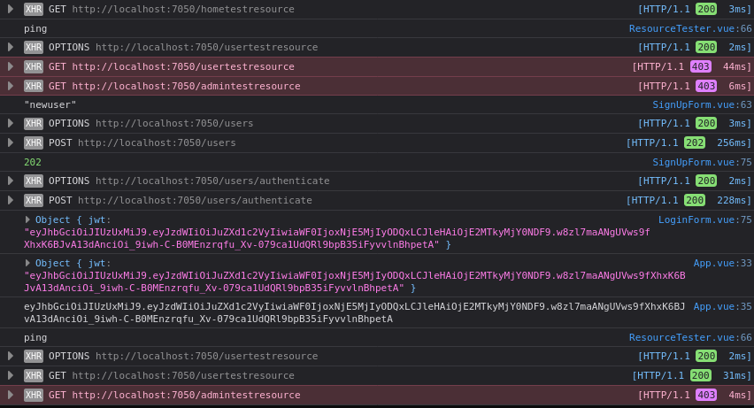
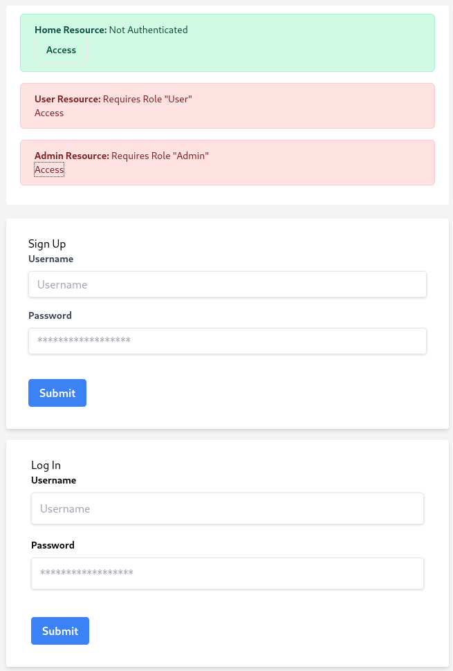
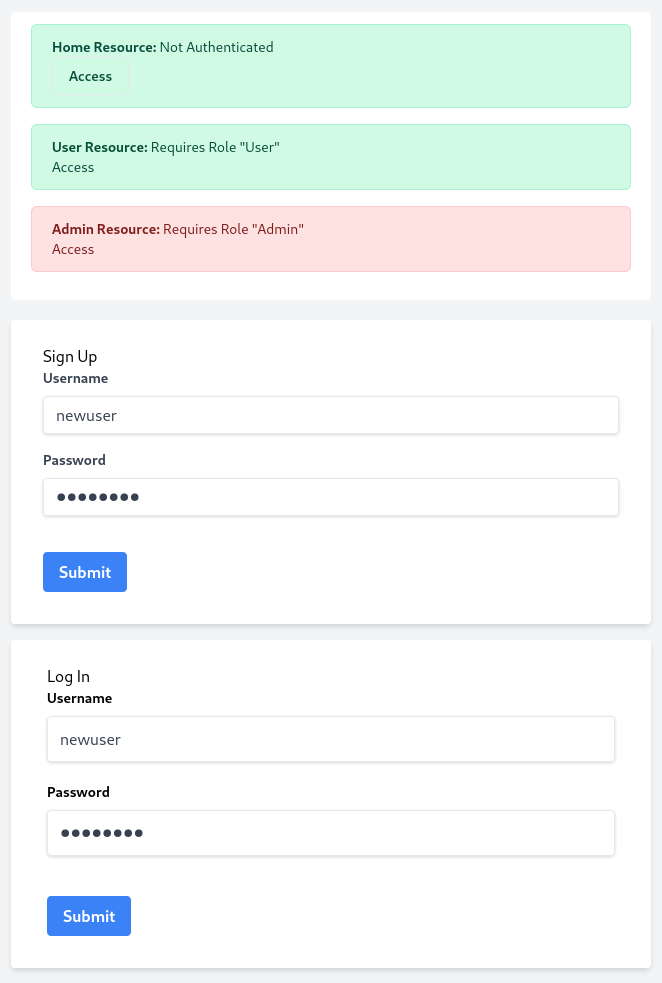

# Basic Authentication using Spring Security

This projects aims to exhibit a simple JSON Web Token based authentication scheme using Spring Security. The project includes a simple Vue client for prototyping.

## Basic Authentication Lifecycle

**Network Calls**

**Not Authenticated**

**After Authentication**

